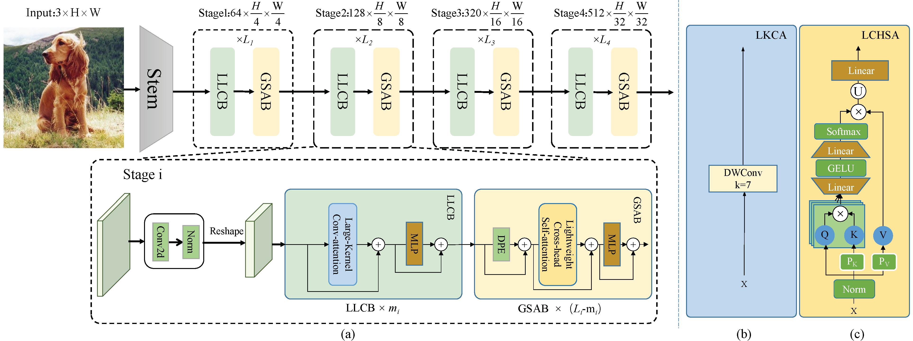

# Introduction
**SUMMNet** extracts local detail features and global semantic features by combining powerful local large convolution block(LLCB) and global vision transformer block(GVTB). LLCB employs large kernel convolution attention(LKCA) to learn the feature extraction of local information, and GVTB adopts lightweight cross-head self-attention(LCHSA) to enhance the representations of global contextual features by the interaction between heads, while reducing the computational complexity. These two components enable SUMMNet to focus on both local and global information at different scales, providing a powerful ability of comprehensive feature representation.

Numerous experiments show that our SUMMNet obtains superior performance in image classification tasks. Particularly, SUMMNet achieves **83.8%** top-1 accuracy on ImageNet-1K with about 9G FLOPs, **0.4%** higher top-1 accuracy than CrossFormer with similar parameters and FLOPs, and achieves **84.1%** top-1 accuracy on ImageNet-1K with about 11G FLOPs, **0.4%** higher top-1 accuracy than Swin-Transformer with **36%** less parameters and **30%** fewer FLOPs.

    <h3> General Framework </h3>

    

## Main results on Image Classification

To validate the effectiveness of our proposed SUMMNet, we conducted extensive experiments on ImageNet-1K image classification task. We compare our SUMMNet with recent state-of-the-art approaches, as shown in Table, where the models are grouped by FLOPs.

| Model           | #Params(M)  | FLOPs(G)   | Top-1(%) | Reference |
| --------------- | ----------- | ---------- | -------- | --------- |
| Twins-SVT-S     | 24          | 2.8        | 81.3     |NeurIPS2021|
| RegionViT-Ti    | 14          | 2.4        | 80.4     | ICLR2022  |
| CrossFormer-T   | 28          | 2.9        | 81.5     | ICLR2022  |
| LIT-Ti          | 19          | 3.6        | 81.1     | AAAI2022  |
| PaCa-Tiny       | 12          | 3.2        | 80.9     | CVPR2023  |
| **SUMMNet-T(ours)**   | **21**          | **3.5**        | **82.3**     |           |
| MViTv2-T        | 24          | 4.7        | 82.3     | CVPR2022  |   
| ConvNeXt-Tiny   | 29          | 4.5        | 82.1     | CVPR2022  |  
| LIT-S           | 27          | 4.1        | 81.5     | AAAI2022    |
| DAT-T           | 29          | 4.6        | 82.0     | CVPR2022  |   
| CrossFormer-S   | 31          | 4.9        | 82.5     | ICLR2022  | 		
| **SUMMNet-S(ours)**       | **30**          | **4.2**        | **82.7**     |           |
| RegionViT-S     | 31          | 5.3        | 82.6     | ICLR2021  |
| SLaK-T          | 30          | 5.0        | 82.5     | ICLR2023 |
| PaCa-Small      | 22          | 5.5        | 83.1     | CVPR2023  |
| BAT             | 26          | 4.7        | 83.1     | ICLR2023  |
| MogaNet-S       | 25          | 5.0        | 83.4     | ICLR2024  |
| LaViT-B         | 40          | 6.1        | 83.1     | CVPR2024  |
| **SUMMNet-B(ours)**       | **37**          | **5.4**        | **83.4**     |           |
| ConvNeXt-S      | 50          | 8.7        | 83.1     | CVPR2022  |
| VAN-L           | 45          | 9.0        | 83.9     | CVPR2023  |
| SLaK-S          | 55          | 9.8        | 83.8     | CVPR2023  |
| ConvNeXt-S      | 50          | 8.7        | 83.1     | CVPR2022  |
| CrossFormer-B   | 52          | 9.2        | 83.4     | ICLR2022  |
| NAT-S           | 51          | 7.8        | 83.7     | CVPR2023  |
| **SUMMNet-L(ours)**       | **49**	        | **8.9**        | **83.8**     |           |
| Swin-B          | 88          | 15.4        | 83.5     | ICCV2021  |
| RegionViT-B     | 73          | 13.0        | 83.2     | ICLR2022  |	
| CrossFormer-L   | 92          | 16.1        | 84.0     | ICLR2022  |	
| MetaFormer      | 73          | 11.6        | 82.5     | CVPR2022  |
| SLaK-B          | 95          | 17.1        | 84.0     | ICLR2023  |
| PPT-B           | 87          | 11.6        | 81.4     | CVPR2023  |
| **SUMMNet-H(ours)**       | **56**          |**11.4**        | **84.1**     |        	  |

## Main results on four downstream datasets

we perform transfer learning from ImageNet-1K to four downstream datasets, including CIFAR10, CIFAR100, StandfordCars, and Pet, as shown in the Table.

| Model           | FLOPs(G)    |CIFAR10     | CIFAR100 | StandfordCar |  Pet  |
| --------------- | ----------- | ---------- | -------- | ------------ | ----- |
| RegionViT-S     | 5.3         | 98.9       | 90.0     | 92.8         |  95.3 |
| RegionViT-M      | 7.4        | 99.0       | 91.9     | 91.9         |  95.5 |
| **SUMMNet-B(ours)**       | 5.4         | 99.1       | 91.2     | 99.6         |  100  |
| **SUMMNet-L(ours)**       | 8.9         | 99.2       | 91.4     | 99.8         |  100  |

## Visualization of Attention Map

To understand how SUMMNet works, we visualize attention maps at the last block of the 3rd stage and compare them before and after the across-head interaction, as shown in Fig.

    

